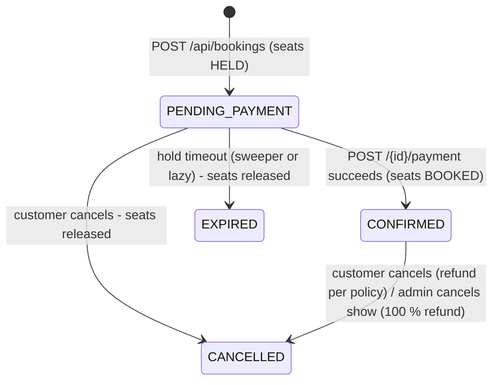
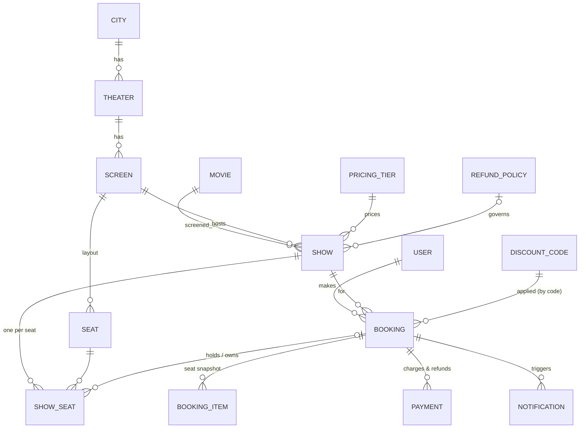

# Movie Ticket Booking System

Spring Boot REST backend for booking movie tickets at scale: multiple cities → theaters → screens → shows, seat-level
booking with **time-boxed holds that auto-release**, tiered/weekend pricing, discount codes, mock payments, refunds
under configurable policies, and **non-blocking notifications**. Concurrent attempts on the same seat are serialised so a
seat can never be double-allocated.

* **Stack:** Java 17, Spring Boot 3.3, Spring Web / Data JPA / Security / Validation, H2 (default) or PostgreSQL, Lombok, JUnit 5 + Mockito + AssertJ + Awaitility
* **Roles:** `ADMIN` (manage master data, pricing, refund policies, discounts, shows) and `CUSTOMER` (browse, book, cancel, history)

---

## 1. Quick start

Requirements: JDK 17+ and Maven 3.9+.

```bash
mvn clean verify          # compile + run all unit and integration tests
mvn spring-boot:run       # start on http://localhost:8080 (in-memory H2, demo data seeded)
```

Seeded accounts (HTTP Basic auth):

| Role     | Email               | Password       |
|----------|---------------------|----------------|
| ADMIN    | `admin@movie.com`   | `Admin@123`    |
| CUSTOMER | `customer@movie.com`| `Customer@123` |

Demo data: 2 cities, 1 theater with 2 screens, 2 movies, a `Standard` pricing tier, a default refund policy,
codes `WELCOME10` (10 %, max ₹100, 3 uses per user) and `FLAT50` (₹50 off orders ≥ ₹300), and 5 upcoming shows
(one on a Saturday to demonstrate weekend pricing).

PostgreSQL instead of H2: create a `moviedb` database, then `mvn spring-boot:run -Dspring-boot.run.profiles=postgres`
(edit `application-postgres.yml` for credentials). Turn off demo data with `--app.seed-demo-data=false`.

A copy-paste curl walkthrough of the whole booking journey is in [`docs/API_WALKTHROUGH.md`](docs/API_WALKTHROUGH.md).

---

## 2. Booking lifecycle



1. **Hold** – customer picks `showSeatIds` from `GET /api/shows/{id}/seats`. Seats become `HELD` for
   `app.hold.duration-minutes` (default 5) and a `PENDING_PAYMENT` booking is created with the price breakdown.
2. **Pay** – `POST /api/bookings/{id}/payment`. On success seats become `BOOKED`, booking `CONFIRMED`, a confirmation
   is queued. A declined payment returns **402** and keeps the hold so the customer can retry until it expires.
   Paying after expiry returns **410**.
3. **Cancel** – pending: seats released. Confirmed: refund computed from the refund policy and time left before the
   show, seats go back on sale. Cancelling twice is idempotent (never refunds twice).

---

## 3. Concurrency design (the core requirement)

The bookable unit is `ShowSeat` (one row per physical seat per show, created when the show is scheduled).

| Layer | Mechanism |
|-------|-----------|
| **Primary** | `SELECT … FOR UPDATE` (`PESSIMISTIC_WRITE`) on the requested `show_seats` rows inside the hold transaction. Racing customers queue on the row lock; the loser then sees `HELD`/`BOOKED` and gets **409 Conflict**. |
| **Deadlock avoidance** | Seat rows are always locked **ordered by id**, whatever order the client sent them. Global lock order is *booking → show-seats (by id) → discount code*. |
| **Safety net 1** | `@Version` on `ShowSeat` – a stale write fails with an optimistic-lock error, mapped to 409. |
| **Safety net 2** | Unique constraint `(show_id, seat_id)` so a seat cannot exist twice per show. |
| **Pay / cancel / expire** | Each first takes a row lock on the **booking**, so a payment racing the expiry sweeper, a cancel, or a duplicate pay request is serialised. Duplicate `pay` calls are idempotent – exactly one charge is recorded. |

Why pessimistic rather than optimistic-only? Seat contention is high and localised (everyone wants the same popular
seat for the same show), so queueing briefly on a row lock is cheaper and gives cleaner behaviour than retry storms.
It also works identically on H2 and PostgreSQL and needs no distributed infrastructure (out of scope).

**Proof:** `ConcurrencyIntegrationTest` releases 20 threads simultaneously at one seat (exactly one wins),
12 threads at overlapping multi-seat requests in random order (no deadlock, no double allocation), 6 concurrent
payments of one booking (one charge), and 8 threads at an already-booked seat (all rejected).

### Hold expiry
Two cooperating mechanisms:
* **Sweeper** – `@Scheduled` job every `app.hold.sweep-interval-ms` (10 s) expires overdue `PENDING_PAYMENT` bookings, one
  transaction each, re-checking under the booking lock (safe against a concurrent payment).
* **Lazy expiry** – a seat whose hold deadline has passed is *treated as available immediately* by both the seat map
  and the hold logic, so users never wait for the next sweep. If a new customer takes over such a seat, the sweeper later
  expires the old booking but only releases seats that **still point at it** – the new owner's hold is untouched.

---

## 4. Pricing, discounts, refunds

* **Pricing tier** (admin): `regularPrice`, `premiumPrice`, `weekendMultiplier` (≥ 1.00). A show references one tier.
  Seat price = base price for the seat type × multiplier if the show starts on Saturday/Sunday. The price is
  **snapshotted onto each `ShowSeat`** at scheduling time, so editing a tier never changes already-listed shows.
* **Discount codes** (admin): `PERCENTAGE` (with optional max cap) or `FLAT`; validity window, minimum order, global
  usage limit, per-user limit, active flag. Validated when seats are held (price shown immediately) and **redeemed
  atomically at payment** under a row lock so the global limit cannot be oversold.
* **Refund policies** (admin): list of rules *"cancelled ≥ N hours before show → refund P %"*; the rule with the largest
  satisfied N wins, otherwise 0 %. A show can name its own policy; otherwise the one flagged `defaultPolicy` is used
  (exactly one default is enforced). `GET /api/bookings/{id}/refund-quote` previews the refund. If an **admin cancels a
  show**, every pending booking is released and every confirmed booking is refunded 100 % regardless of policy.

## 5. Notifications (never block the booking flow)

Domain code publishes a plain-data `NotificationEvent`. A `@TransactionalEventListener(AFTER_COMMIT)` +
`@Async("notificationExecutor")` listener delivers it on a dedicated thread pool:
* **after commit** – nothing is sent for a transaction that rolled back;
* **off the request thread** – HTTP latency is unaffected by slow/failed delivery;
* **resilient** – 3 attempts, outcome (`SENT`/`FAILED`) persisted in `notifications`, never throws into the caller.

Types: booking confirmation, hold expired, cancellation, refund processed, show cancelled, and a **show reminder**
(scheduled scan every minute finds confirmed bookings starting within `app.reminder.lead-minutes` = 120; a
`reminderSent` flag set under lock guarantees exactly-once). The channel is an interface; the bundled implementation
logs the "email" – swap in SES/SMTP without touching booking code. Customers can read theirs at `GET /api/notifications`.

---

## 6. Security / RBAC

Stateless HTTP Basic, BCrypt-hashed passwords, users in the DB. Public sign-up always creates a `CUSTOMER`; the admin is
bootstrapped from config (`app.admin.*`).

| Path | Access |
|------|--------|
| `POST /api/auth/register` | public |
| `GET /api/auth/me`, browsing (`/api/cities`, `/api/movies`, `/api/shows/**`) | any authenticated user |
| `/api/admin/**` | `ADMIN` |
| `/api/bookings/**`, `/api/notifications` | `CUSTOMER` |

Customers can only see/modify **their own** bookings (others' ids return 404, so existence is not leaked).
401/403 return the same JSON error body as everything else.

## 7. API summary

| Method & path | Who | Purpose |
|---|---|---|
| `POST /api/auth/register` | public | create customer |
| `GET /api/cities`, `/api/cities/{id}/theaters`, `/api/movies` | any | browse |
| `GET /api/shows?cityId&movieId&theaterId&date` | any | upcoming shows (filters optional) |
| `GET /api/shows/{id}`, `/api/shows/{id}/seats` | any | show detail / seat map with live status & price |
| `POST/PUT /api/admin/cities`, `/theaters`, `/movies` | admin | master data |
| `POST/GET /api/admin/theaters/{id}/screens` | admin | screen + seat layout (rows: label, count, REGULAR/PREMIUM) |
| `POST/PUT/GET /api/admin/pricing-tiers` | admin | pricing tiers |
| `POST/PUT/GET /api/admin/refund-policies` | admin | refund policies |
| `POST/PUT/GET /api/admin/discount-codes` | admin | discount codes |
| `POST /api/admin/shows` | admin | schedule show (generates priced seats, rejects overlaps) |
| `GET /api/admin/shows/{id}/stats` | admin | occupancy + confirmed revenue |
| `POST /api/admin/shows/{id}/cancel` | admin | cancel show, refund everyone |
| `GET /api/admin/bookings?showId=` | admin | all bookings |
| `POST /api/bookings` | customer | hold seats (`{showId, showSeatIds, discountCode?}`) |
| `POST /api/bookings/{id}/payment` | customer | pay (`{paymentMethod, paymentToken}`; token starting `fail` is declined by the mock gateway) |
| `POST /api/bookings/{id}/cancel` | customer | cancel (optional `{reason}`) |
| `GET /api/bookings/{id}/refund-quote` | customer | refund if cancelled now |
| `GET /api/bookings`, `/api/bookings/{id}` | customer | history / detail |
| `GET /api/notifications` | customer | my notifications |

**Error contract** (all errors): `{timestamp, status, error, message, path, details[]}`.
`400` validation · `401` unauthenticated · `402` payment declined · `403` forbidden · `404` not found ·
`409` seat taken / conflict / concurrent modification · `410` hold expired.

---

## 8. Data model



Package layout: `controller` (HTTP + RBAC) → `service` (transactions, business rules) → `repository`; `domain` (entities),
`dto` (records + Bean Validation), `notification`, `payment` (gateway port + mock), `scheduler`, `security`, `exception`, `config`.

---

## 9. Assumptions & scoping decisions

* **Seat layout** is defined per screen as rows (label, seat count, `REGULAR|PREMIUM`); seats are generated from it.
* **Pricing tiers** are named price cards attached to a show (regular / premium / weekend surcharge). Weekend = Sat/Sun of
  the show start in the configured timezone (`Asia/Kolkata`). Holidays / surge pricing are out of scope.
* **Hold** length is global config (5 min). A booking may contain up to 6 seats (config), all from one show.
* **Screens cannot host overlapping shows**; a 15-minute changeover buffer is enforced.
* **Payments are mocked** behind a `PaymentGateway` port; refunds go to the original payment method and always succeed in the mock.
  A ₹0 total (100 % discount) confirms without a charge.
* **Discount usage** is counted at payment (not at hold) and is *not* restored on cancellation. Holds are not
  reserved against the global limit, so the limit is enforced (with a lock) at redemption time; a customer who loses the
  race gets a clear 409 and can rebook without the code.
* **Refund basis** is the amount actually paid (after discount). A booking cannot be cancelled once its show has started.
* **Admin-cancelled shows** refund 100 % and ignore the policy; already-cancelled bookings are skipped so retries are safe.
* **Show edits** (time change) are not supported – cancel and reschedule – because tickets and price snapshots are tied to the slot.
* **Auth** is HTTP Basic for simplicity (OAuth/SSO/MFA explicitly out of scope). No password reset / email verification.
* **Notifications** are simulated by logging + a persisted record; no real SMTP/SMS.
* Deletion endpoints are omitted on purpose (history and FK integrity); movies/discounts are deactivated via `active`.

### Known limitations / next steps
* Schema is generated by Hibernate (`ddl-auto`); production would use Flyway migrations.
* Sweeper/reminder jobs assume a single instance; multi-instance would add a lock (e.g. ShedLock) – row locks already keep them *correct*, only redundant.
* Notifications use in-process async; a durable outbox + broker would guarantee delivery across crashes.
* Pagination on list endpoints, rate limiting, idempotency keys on `POST /bookings`, and a seat-map cache are natural additions.

---

## 10. Testing approach

| Level | What | Files |
|---|---|---|
| **Unit** (no Spring context) | pricing incl. weekend & rounding; refund-rule selection & boundaries; discount evaluation (cap, flat, expiry, min order, global/per-user limits); seat state machine incl. lazy expiry; notification retry/failure handling | `src/test/.../unit` |
| **Integration** (full app, H2, real security chain, MockMvc) | happy path hold→pay→async confirmation→history; payment failure & retry; hold expiry (lazy, sweeper, pay-after-expiry, takeover safety); cancel + refund tiers (100/75/0 %); discounts; admin show cancellation; reminders exactly-once; RBAC (401/403), ownership isolation; validation & error contract; weekend pricing; overlap prevention | `BookingFlow…`, `RefundAndDiscount…`, `SecurityAndValidation…` |
| **Concurrency** (multi-threaded, latch-released) | 20 racers/1 seat; overlapping multi-seat, random order (deadlock & double-allocation check); concurrent duplicate payments; hammering a booked seat | `ConcurrencyIntegrationTest` |

Integration tests build their own uniquely-named data, so they are order-independent; scheduled jobs are disabled in the
`test` profile and triggered explicitly; hold expiry is simulated by back-dating the deadline (no sleeping);
asynchronous effects are asserted with Awaitility rather than fixed sleeps.

Run: `mvn test` (or `mvn clean verify`).

## 11. AI-assisted workflow

See [`CLAUDE.md`](CLAUDE.md) / [`AGENTS.md`](AGENTS.md) (project instructions given to the AI agent), the skills in
[`.claude/skills/`](.claude/skills), and [`docs/AI_WORKFLOW.md`](docs/AI_WORKFLOW.md) for how the work was split between
the AI and the human reviewer.
